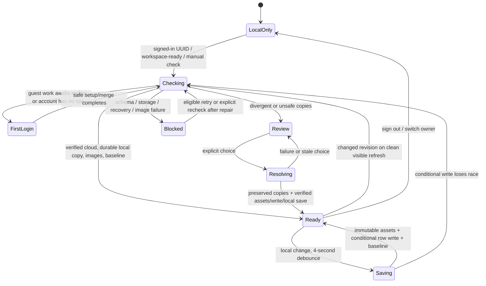

# Premed OS account sync investigation — September 30, 2026

Investigated public `main` at **9aa401c1f7515cc455d03b5e5786c99d44a94f72** in an isolated worktree. References below identify the patched worktree unless explicitly labelled **base**. All new fixtures are synthetic. No real workspace, email, token, browser profile, production row, or hosted configuration was read or changed.

The code confirms several mechanisms that can produce confusing reviews or browser drift. It does **not** establish the exact September 21/30 incident differences, why the real identities split, why Arc lost IndexedDB, or which 25 hashes explain the historical image count. Current-format account recovery succeeded in the synthetic restore-to-sync test.

## Confirmed findings, ranked by expected exposure

This ranking is based on how readily each trigger occurs in the code, not measured production frequency.

| Rank | Confirmed trigger and consequence | Evidence / formerly failing test | Smallest included fix and regression risk |
|---|---|---|---|
| 1 | A browser left open receives no normal periodic, focus, or visibility pull on base. It may display old work indefinitely until re-login, manual pull, workspace-ready event, or a competing save causes reconciliation. | **Base** `src/store/useCloudSync.ts:268–323`; `accountSyncInvestigation.test.ts` tests `refreshes an unchanged visible browser on focus/visibilitychange` failed with Baseline instead of Other browser edit. | Visible, online, already-ready clean accounts probe revision metadata every 60 seconds and on focus/visibility/online. Only a changed revision triggers full reconciliation. No background review starts for unsent authored work. Risks: more metadata requests and new cancellation races; covered by hidden/offline/dirty/paused guards, unchanged-image-sweep check, and edit-during-refresh regressions. |
| 2 | Local navigation changes `meta.lastOpenedAt/recentRoutes`; a later authored cloud edit makes both exact baseline checks fail even though local authored work was unchanged. Direct device/cloud housekeeping normalization cannot help because their authored content now differs. | **Base** `useCloudSync.ts:148–156`, `accountSyncSafety.ts:64–80`; `accountSyncInvestigation.test.ts` test `does not mistake route-only local changes…` failed by opening a preserved conflict. | Record optional **local-only** `comparableDigestV1` from the same confirmed baseline content. Compare with existing narrow normalization; keep original raw digest and legacy v1 record unchanged. Existing baselines lacking the new hash remain conservative until a successful verified sync records it. Risks: concealing authored edits or blessing dirty work; tests preserve settings/history/unknown/authored conflicts, original hashes on rebase, and pause fencing during hashing. |
| 3 | MergePage says whole copies look the same when its selected areas match, although settings/history/legacy notes/unknown sections differ. The displayed class/task counts are not its actual equality test. | `src/pages/public/MergePage.tsx:136–148,275–280`; four formerly failing settings/notes/history/opaque tests at `MergePage.test.tsx:111`. | Use full comparable content for the whole-copy claim; otherwise say listed areas match but other saved data differs. Per-area merge actions are unchanged. Risk: wording may reveal a difference outside selectable areas; the account review remains the authoritative resolution. |
| 4 | See differences omits pure record order changes even though safety comparison treats them as changes; it also displays housekeeping that safety comparison ignores. | `src/store/accountCopyComparison.ts:17–24`; formerly failing order/housekeeping tests at `accountCopyComparison.test.ts:73`. | Show shared-record order differences and use the same narrow normalization for display. Safety classifier unchanged. Risk: bounded display is still incomplete (60 rows; 240 characters/value), and unknown sections retain their separate preservation notice. |
| 5 | Transient notebook upload errors lose HTTP/retryability information and become plain errors, preventing the hook's intended automatic retry. | **Base** `sharedNotebookAssets.ts:33–35`; formerly failing tests `preserves upload HTTP 503/403…`, `stops upload retries…`, `verifies immutable readback after an upload retry…`. | Use existing guarded `cloudRequest`: four bounded attempts for retryable failures, no retry for 403, 409 accepted only before hash/size readback. Keep `upsert:false`. Risks: duplicate immutable upload attempts after lost responses; readback and ownership/pause guards cover this. |
| 6 | A rejected local asset read blocks sync even when that image exists intact in the account. | **Base** `sharedNotebookAssets.ts:46`; formerly failing `verifies intact cloud bytes without depending on a readable local image cache`. | Preserve local-first cache warming, catch local read failure, then verify remote bytes independently. If remote is absent, preserve the local failure/missing-image stop. Risk: cloud availability is not a promise that offline local caching succeeded. |
| 7 | A never-resolving image read/upload leaves ordinary sync/setup pending indefinitely. Explicit conflict review already had its own idle timeout. | **Base** `sharedNotebookAssets.ts:40–61`; formerly failing stalled upload/download tests at `sharedNotebookAssets.test.ts:53,71`. | Give every image batch a 120-second timeout since last verified progress; throw a retryable error and fence late continuations. Risks: very slow individual objects may time out; an already-started immutable upload can finish, but cannot then acknowledge progress or cause a dashboard write. |

The patch also handles safe cancellation when a user edits during reconciliation: it keeps sync paused and retries the check through the existing 60-second/online mechanism. It never treats that cancellation as permission to upload. This prevents the new refresh path from creating a permanent pause during normal interaction.

## Sync state machine

`status` is a UI label, not the safety state. In particular, `error` does not always mean the account readiness latch was cleared. Actual upload authorization requires the current session generation, verified generation, no conflict/schema block, matching workspace owner, and durable matching data (`accountSyncSafety.ts:24–50`).



### Every pause or effective write block and its release

| State / trigger | What resumes it |
|---|---|
| No configured Supabase client, no signed-in user, or account UUID changes | Configure a client/sign in. UUID changes invalidate readiness and stale work; a new session must reconcile. Signed-out local operation remains available. |
| Reconciliation starts (`useCloudSync.ts:73`) | Only successful local activation/flush, full image verification, verified baseline and `allowAccountSync(lease)` complete it (`174–194`). |
| First-login guest work, no account cache, merge not reviewed (`useCloudSync.ts:116`) | Complete the existing setup/merge flow. It must emit the account-workspace-ready event; no implicit upload of guest work. |
| Cloud row absent (`useCloudSync.ts:121–125`) | Safe setup when appropriate. Existing local account data is preserved for review; there is no automatic empty-row replacement. A missing remote or unreadable/open recovery does not qualify for the ordinary two-copy buttons. |
| Detached unsaved outgoing copy; open memory not confirmed durable; unreadable cached account (`useCloudSync.ts:88–113`) | Save/export/recover the exact open/cache copy and explicitly recheck. A readable later copy does not authorize discarding unconfirmed work. |
| True two-copy divergence or unknown-section omission (`useCloudSync.ts:160–166`) | Successful explicit conflict review only. A saved two-copy review short-circuits normal rechecks (`48–52`); neither polling nor retry chooses a winner. |
| Recovery archive fails or fails readback (`accountSyncSafety.ts:137–190`) | Restore storage health and recheck/preserve again. Failure does not authorize replacement. Copies remain downloadable where available. |
| Unsupported/contradictory cloud or local schema; server guard rejects stale client | Export/recover and reopen a compatible client. Schema blocks are sticky for that page session (`accountSchemaBlock.ts` has no clearing function). No bypass in patch. |
| Missing `cloud_schema/write_rev` columns | Existing 60-second/online retry can re-read after the server is corrected. No legacy fallback writer. A database migration/config change, if actually needed, is outside this patch. |
| Retryable network failure during reconciliation | Existing bounded request retries, then 60-second/online reconciliation. In patch, image timeouts/upload transport failures and same-owner snapshot cancellations participate. |
| Nonretryable read, malformed row, storage/durability error, missing/corrupt image | Repair source/storage/auth problem and manually recheck; incomplete metadata/assets never count as synced. |
| Local save pending, failed, pointer changed, disk conflict, or owner mismatch | A queued save may finish normally; failed/corrupt/conflicting storage needs recovery. Durable checks block every upload independently of the UI status. |
| Cloud compare-and-set loses race (`DashboardWriteMiss`) | Immediate reconciliation against the newer row. If both authored copies changed, it then needs explicit review. |
| Explicit setup/merge/restore mutation pauses sync (`accountMutationSafety.ts:125–153,181–196`) | Durable local completion and workspace-ready reconciliation. Cloud accepted/local failed stays paused and reports partial completion. |
| Conflict choice is uploading/verifying images (`accountMutationSafety.ts:241–291`) | Every referenced hash verifies, selected write/readback succeeds, local application is durable, baseline is recorded, exact reviewed conflict is removed (`accountSyncSafety.ts:198–214`). |
| Stale auth generation, workspace epoch, review, or pause lease | The current owner/operation must complete its own check. A stale continuation may not re-enable sync. |

Ordinary `pushNow` errors only explicitly clear readiness for schema or missing-column failures (`useCloudSync.ts:268–273`); other errors can leave readiness true while the operation returns false. They are still subject to all durable/ownership guards. Retryable errors get the retry path; permanent asset/auth failures require repair. This distinction prevents interpreting an error label as a single universal pause enum.

## A. Same counts, different content

MergePage's selected `AREAS` exclude `timelineMilestones`, `resources`, `tips`, `advisingQs`, `captures`, the legacy `notes` map, `settings`, `meta`, `trash`, and unknown top-level sections. Its original area equality uses JSON for these selected fields, not just counts. Identical counts also cannot establish identical titles, statuses, task order, notebook content, or retained versions.

The generic text “Existing records or other settings differ” is a fallback when there are no uniquely identified records (`accountCopyPresentation.ts:32`); it is not a diagnostic of which field differed.

| Field group | Base comparison behavior |
|---|---|
| `_schema` marker, `settings.backup`, private local-only stories and their private trash/history | Excluded from shared exact sync identity (`accountSyncContent.ts`, extracted without changing its algorithm). Schema gates run separately. |
| `meta.lastOpenedAt`, `meta.recentRoutes`, `settings.calendar.lastSyncedAt` | Ignored by comparable content. **Base raw baseline hashes still included them**, causing finding 2 when cloud authored data changed. |
| Four missing-versus-empty Research containers; task `typeId` uniquely inferred from its existing label/catalog | Narrow compatibility normalization. Explicit, ambiguous or mismatched task IDs remain differences. |
| `meta.activity`, nonprivate `recoveryStack`, task/notebook `createdAt/updatedAt`, other settings, Trash | Included. These can represent actual user actions, recovery history, deletions or authored preferences; no blanket timestamp/history removal is safe. |
| Unknown sections | Included in full equality and safety classification. Missing unknown sections force preservation/review. Bounded known-field display does not expand their contents. |

No evidence shows that two current copies *always* differ after every reload. The current synthetic recovery passed. The exact incident fields remain unknown; the minimal next diagnostic would be **field paths only** and the booleans described under B, without values or workspace contents.

## B. Restore to review: exact path and conditions

1. Preboot account recovery reads/gates the row, captures its exact revision, re-reads it at confirmation, writes an envelope with `version:0` into IndexedDB, verifies it, then publishes the pointer (`workspaceBootRecovery.ts:85–133`). It does not write the cloud or assert that the local copy is synced.
2. Opening the app initializes durable storage, imports the store and runs supported migrations for version zero (`workspaceBootstrap.ts:22–40`, `store.ts:115–117,573–623,1005–1027`). Account reconciliation reads the durable account and gated remote row again.
3. A legacy unclaimed cloud row is claimed by an existing conditional write of the reviewed cloud document plus marker; only its revision metadata changes. Claim races are retried up to the existing limit (`useCloudSync.ts:130–147`). This is pre-existing behavior, not a patch protocol change.
4. Reconciliation computes:

   ```text
   equal = exact device/cloud equality OR narrow comparable equality
   cleanLocal = device matches recorded baseline
   remoteUnchanged = cloud updated_at matches baseline AND cloud content matches baseline
   needsReview = local exists AND not equal AND
                 ((not cleanLocal AND not remoteUnchanged) OR unknown-section omission)
   ```

5. If `needsReview`, preserve both exact copies, publish conflict, activate only the preserved device copy, and leave readiness false (`useCloudSync.ts:150–166`). That produces the banner. The merge page may simultaneously omit the differing sections, causing its formerly misleading equality message.
6. If a copy is adopted safely, verify images **after** activation and durable flush, then record baseline and enable sync. Missing image bytes cause an error/blocked completion; they are **not** the equality predicate that creates an ordinary two-copy review.

`write_rev` guards writes; a mismatch causes re-read, not an automatic declaration that content differs. `updated_at` participates in ancestor recognition. Digest/comparable content establishes equality. Invalid schema/claim is a separate blocked recovery. Unknown-section omission is an explicit conservative conflict. Image manifests are part of document content when bindings differ, while missing object bytes alone are an asset failure.

**Synthetic result:** recovery from a missing IDB pointer using a current cloud fixture → real migrations/persistence → mocked claimed dashboard → sync readiness succeeded, with zero cloud writes (`accountSyncInvestigation.test.ts:57`). An older/sparse document could be migrated into genuinely different content, but its precise field changes need evidence; the patch does not normalize arbitrary migrations away.

The “newest” suggestion uses the device repository's save time versus cloud save time (`accountMutationSafety.ts:223–226`, `accountCopyPresentation.ts:4–7`). A restore or migration can create a newer local save timestamp without newer authored work. The button still requires an explicit choice.

## C. Images and the 225-object progress

`workspaceAssets(data).images` is a Map keyed by SHA-256. It recursively finds notebook image bindings under known workspace sections, including retained notebook versions, Trash and recovery records (`workspaceAssets.ts:6–28`). Repeated uses of one hash count once. Unknown sections are not interpreted as asset references.

Thus **225 is the chosen copy's distinct referenced image count**, not the number newly uploaded and not a bucket listing. Already-present cloud objects count as verified progress. The prior 200-object verification may have counted a different snapshot or scope; code alone cannot determine which 25 hashes account for the difference. Minimum evidence would be counts/scopes/dates or sanitized hash-set differences, not original images or documents.

A missing local image is allowed if its cloud bytes verify. A missing/unreadable local image plus missing cloud image stops before dashboard replacement. Corrupt cloud bytes are never blindly overwritten. “Keeping: This device” names the pending choice; it is not a completion receipt (`AccountConflictReview.tsx:65`). The choice waits for images, conditional metadata write/readback, durable local completion and conflict removal.

The explicit review already had a 120-second idle image timeout. The patch extends that bound to other image-sync callers, catches unreadable local caches when the cloud is intact, and preserves upload failure status/retryability. HTTP requests retry after 2, 4 and 8 seconds when appropriate. A batch timeout resets on each verified image, not each attempted network request.

Remaining limit: an object read that never resolves now times out; it cannot prove remote availability while stuck. Already-started network writes cannot be unsent, but assets are immutable and all later continuations are fenced. Dashboard/auth reads outside the image stage still rely on their underlying network promise; `cloudRequest` has retries for settled errors but no universal wall-clock timeout. No dashboard/auth timeout redesign is included. Per-image review guards repeatedly inspect auth and snapshot freshness; their performance on 31 MB documents was not measured.

## D. Google and magic-link identity

The app isolates accounts by Supabase UUID: `demoMode.ts:65–70`, row `user_id` predicates in `dashboardRows.ts:43–46`, and session/workspace switching in `useCloudSync.ts:289–294`. It never calls `linkIdentity()` or `unlinkIdentity()`.

Google uses `signInWithOAuth` (`AuthPage.tsx:419–422`). Magic links use `signInWithOtp` without `shouldCreateUser:false` (`AuthPage.tsx:260–263`, `useCloudSync.ts:382–385`). A previously unknown address may therefore create an Auth user. The app intentionally shares outward sign-in/create outcomes for enumeration safety; changing that is a product decision, not a demonstrated fix for this split. [Supabase passwordless email documentation](https://supabase.com/docs/guides/auth/auth-email-passwordless)

Supabase documents automatic linking for matching emails with verification safeguards. Different-email OAuth linking needs a signed-in `linkIdentity()` flow and enabled manual linking. The repository does not specify manual linking; hosted settings were not inspected. Merely choosing different providers does not explain why two real UUIDs were created. [Supabase identity-linking documentation](https://supabase.com/docs/guides/auth/auth-identity-linking)

A wrong UUID with no row goes to onboarding; the current email is displayed, and the flow says “This account starts clean” (`MergeGate.tsx:48–60`, `FirstLoginSetupPage.tsx:212,296,323–328`). There is no explicit detection that another account contains the intended workspace. Settings and the signed-in gate show the account email and allow sign-out.

Synthetic tests characterize both cases: distinct Google/email UUIDs remain isolated with no unauthorized cloud write; one shared UUID reopens the same workspace pointer (`accountIdentityIsolation.test.tsx:96,122`). A mocked client cannot reproduce or prove the hosted Auth server's actual linking decision.

The minimal remaining diagnostics are **booleans only**: whether provider emails matched exactly, whether both were verified, whether the UUIDs differed, and whether both browsers target the same project. Do not send email addresses, UUID values, tokens, or real workspace data.

## E. Why browsers drift

On base, changes upload after four seconds of quiet, but ordinary cloud pulls happen only at session-ID change, workspace-ready events, manual pull, retryable errors, and conditional-write conflicts. Token refresh for the same UUID does not reconcile. There is no Supabase Realtime dashboard subscription and no regular/focus/visibility read.

Consequently a clean second browser can remain stale. If both browsers author changes before checking each other, row CAS prevents silent overwrite and pauses for review. Baseline housekeeping can turn a navigation-only change into apparent divergence. A preserved review intentionally blocks both sync and automatic backups until the user resolves it. Missing bytes, schema/storage failures and interrupted recovery produce the additional states in the table above.

The patch's clean visible browser probes are a refresh mechanism, not automatic conflict resolution. Hidden/offline/dirty/blocked accounts are skipped, overlapping checks deduplicate, unchanged revisions avoid dashboard/image reads, and session/owner/durable state is rechecked across asynchronous boundaries. Ordinary edits still use the existing conditional write/reconciliation path.

## F. IndexedDB disappearance and persist()

There is no production `deleteDatabase` call in `src`. Opening a missing database creates its stores (`workspaceRepository.ts:42–51`), so a recreated folder timestamp can indicate the **next attempted read**, rather than the moment prior data disappeared. A fake-indexeddb deletion/reopen test reproduces that symptom and confirms the surviving pointer is retained and default seeding is refused (`workspacePersistence.test.ts:153`). It does not identify the real deletion cause.

Persistence requests are already implemented correctly at the code boundary: verified saves call `requestAfterSave()` (`workspacePersistence.ts:100–107`), recovery does so after verification (`workspaceBootRecovery.ts:133`), startup rechecks current status, and `persistentStorage.ts:20–39` verifies `persisted()` after requesting `persist()`, at most once per page session. Mocked grant/denial/error/timing tests pass. **Whether Arc actually granted persistence remains unknown.**

Storage pressure may evict best-effort storage; Chromium usually grants or denies persistence silently based on heuristics. A request is not a grant. [Chrome team's persistent-storage guidance](https://web.dev/articles/persistent-storage)

Safari's documented ITP limit concerns seven days **of Safari use without site interaction**, includes IndexedDB and localStorage, and does not explain an Arc/Chromium incident. WebKit describes origin-wide storage eviction and its persistence heuristics separately; surviving localStorage alone is not proof of that cause. [WebKit ITP](https://webkit.org/blog/10218/full-third-party-cookie-blocking-and-more/), [WebKit storage policy](https://webkit.org/blog/14403/updates-to-storage-policy/)

Private sessions discard their temporary data on closure. Profiles use separate website data; a profile switch can expose different storage without deleting the original profile. [Chrome Incognito](https://support.google.com/chrome/answer/95464), [Safari profiles](https://support.apple.com/en-ie/105100)

The remaining non-content facts needed are browser/version, normal/private mode, same profile and origin, actual `persisted()` boolean, and any storage/deletion error code. The patch retains the missing-IDB stop; bypassing it could seed an empty workspace over recoverable work.

## Validation and delivery boundary

The accompanying `account-sync-2026-09-30-tests.md` (also delivered as `TEST-EVIDENCE.md`) records red/green commands and final checks. Final validation: 315 files / 2,485 tests passed; build passed; lint passed with 0 errors and 55 existing warnings. `account-sync.patch` contains code, synthetic regression tests and this investigation. `regressions-only.patch` allows the new tests to be applied to the base to reproduce failures before fixes.

No dependencies were added: fake-indexeddb was already pinned at 6.2.5 on main. No database migration, cloud row schema, CAS protocol, storage object path, Auth configuration, design token, font, notebook screen or academics screen was changed. The optional comparable hash extends only local baseline metadata; the raw digest and legacy baseline record remain compatible. No real data/course material was added.

Potential configuration/product work is explicitly excluded: a manual identity-linking flow would need enabled hosted linking and separate UX/security review; changing magic-link signup policy needs an explicit product decision. Neither is required for the client fixes. Missing server columns would require evidence and deployment/config work, but were not established here.

This is a reviewed local patch, not a merged release, live deployment, or verification of the user's account. No real account was signed into or queried. Exact incident attribution remains open at the evidence boundaries above.
